[](https://circleci.com/gh/getndazn/dazn-lambda-powertools)

# DAZN Lambda Powertools

`dazn-lambda-powertools` is a collection of middlewares, AWS clients and helper libraries that make working with lambda easier.

## Motivation

Writing Lambdas often involves the bootstrapping of specific tooling, like reading and forwarding on correlation-id's, emitting logs on a lambda timeout, and more.

Re-writing and maintaining this bootstrapping logic into every individual lambda can be a pain, so to prevent this re-work we created `dazn-lambda-powertools`.

## Usage

The quickest way to get setup is to use the opinionated [pattern basic](/packages/lambda-powertools-pattern-basic) package.

`npm install @dazn/lambda-powertools-pattern-basic`

```javascript
const wrap = require('@dazn/lambda-powertools-pattern-basic')

module.exports.handler = wrap(async (event, context) => {
  return 42
})
```

For more control, you can pick and choose from the [individual packages](/packages).

## Powertools and Middy

All of the powertool middlewares use the [middy](https://github.com/middyjs/middy) library, and therefore adhere to the middy API.

However, the other tools such as the clients are generic.

## What's in Powertools

An integrated suite of powertools for Lambda functions that reduces the effort to implement common lamdba tasks, such as dealing with correlation-ids.

* support correlation IDs

* debug logs are turned off in production, and are instead sampled for 1% of invocations

* debug logging decisions are respected by all the functions on a call chain

* HTTP requests always report both latency as well as response count metrics

## Overview of available tools

* [logger](/packages/lambda-powertools-logger): structured logging with JSON, configurable log levels, and integrates with other tools to support correlation IDs and sampling (only enable debug logs on 1% of invocations)

* [correlation IDs](/packages/lambda-powertools-correlation-ids): create and store correlation IDs that follow the DAZN naming convention

* [correlation IDs middleware](/packages/lambda-powertools-middleware-correlation-ids): automatically extract correlation IDs from the invocation event

* [sample logging middleware](/packages/lambda-powertools-middleware-sample-logging): enable debug logging for 1% of invocations, or when upstream caller has made the decision to enable debug logging

* [obfuscater middleware](/packages/lambda-powertools-middleware-obfuscater): allows you to obfuscate the invocation event so that sensitive data (e.g. PII) is not logged accidentally

* [log timeout middleware](/packages/lambda-powertools-middleware-log-timeout): logs an error message when a function invocation times out

* [stop infinite loop middleware](/packages/lambda-powertools-middleware-stop-infinite-loop): stops infinite loops

### Client libraries

* [http client](/packages/lambda-powertools-http-client): HTTP client that automatically forwards any correlation IDs you have captured or created, and records both latency as well as response count metrics

* [CloudWatchEvents client](/packages/lambda-powertools-cloudwatchevents-client): CloudWatchEvents client that automatically forwards any correlation IDs you have captured or created when you put events to an event bus

* [EventBridge client](/packages/lambda-powertools-eventbridge-client): EventBridge client that automatically forwards any correlation IDs you have captured or created when you put events to an event bus

* [SNS client](/packages/lambda-powertools-sns-client): SNS client that automatically forwards any correlation IDs you have captured or created when you publish a message to SNS

* [SQS client](/packages/lambda-powertools-sqs-client): SQS client that automatically forwards any correlation IDs you have captured or created when you publish a message to SQS

* [Kinesis client](/packages/lambda-powertools-kinesis-client): Kinesis client that automatically forwards any correlation IDs you have captured or created when you publish record(s) to a Kinesis stream

* [Firehose client](/packages/lambda-powertools-firehose-client): Firehose client that automatically forwards any correlation IDs you have captured or created when you publish record(s) to a Firehose delivery stream

* [Step Functions client](/packages/lambda-powertools-step-functions-client): Step Functions client that automatically forwards any correlation IDs you have captured or created when you start an execution

* [Lambda client](/packages/lambda-powertools-lambda-client): Lambda client that automatically forwards any correlation IDs you have captured or created when you invokes a Lambda function directly

* [DynamoDB client](/packages/lambda-powertools-dynamodb-client): DynamoDB client that automatically forwards any correlation IDs you have captured or created when you perform put or update operations against DynamoDB. These correlation IDs are then available to functions processing these events from the table's DynamoDB Stream.

### Patterns

* [basic template for a function](/packages/lambda-powertools-pattern-basic): wrapper for your function that applies and configures the function to work well with datadog metrics and sample logging

* [obfuscate template](/packages/lambda-powertools-pattern-obfuscate): basic template (above) + obfuscate the invocation event so sensitive data is obfuscated in the `after` and `onError` handlers.

## Installing the powertools

### via NPM

| Package | Install command |
| --- | --- |
| cloudwatchevents-client | npm install @dazn/lambda-powertools-cloudwatchevents-client |
| correlation-ids | npm install @dazn/lambda-powertools-correlation-ids |
| dynamodb-client | npm install @dazn/lambda-powertools-dynamodb-client |
| eventbridge-client | npm install @dazn/lambda-powertools-eventbridge-client |
| firehose-client | npm install @dazn/lambda-powertools-firehose-client |
| http-client | npm install @dazn/lambda-powertools-http-client |
| kinesis-client | npm install @dazn/lambda-powertools-kinesis-client |
| lambda-client | npm install @dazn/lambda-powertools-lambda-client |
| logger | npm install @dazn/lambda-powertools-logger |
| middleware-correlation-ids | npm install @dazn/lambda-powertools-middleware-correlation-ids |
| middleware-log-timeout | npm install @dazn/lambda-powertools-middleware-log-timeout |
| middleware-obfuscater | npm install @dazn/lambda-powertools-middleware-obfuscater |
| middleware-sample-logging | npm install @dazn/lambda-powertools-middleware-sample-logging |
| middleware-stop-infinite-loop | npm install @dazn/lambda-powertools-middleware-stop-infinite-loop |
| pattern-basic | npm install @dazn/lambda-powertools-pattern-basic |
| pattern-obfuscate | npm install @dazn/lambda-powertools-pattern-obfuscate |
| sns-client | npm install @dazn/lambda-powertools-sns-client |
| sqs-client | npm install @dazn/lambda-powertools-sqs-client |
| step-functions-client | npm install @dazn/lambda-powertools-step-functions-client |

### via Lambda layer

You can also deploy the layer via our SAR app, which you can deploy either via [this page](https://serverlessrepo.aws.amazon.com/applications/arn:aws:serverlessrepo:us-east-1:570995107280:applications~dazn-lambda-powertools) (click `Deploy` and follow the instructions) or using CloudFormation/Serverless framework/AWS SAM:

```yml
DaznLambdaPowertoolsLayer:
  Type: AWS::Serverless::Application
  Properties:
    Location:
      ApplicationId: arn:aws:serverlessrepo:us-east-1:570995107280:applications/dazn-lambda-powertools
      SemanticVersion: <enter latest version>
```

and reference the output `Outputs.LayerVersion` to get the ARN of the layer to reference in your function. e.g. `Fn::GetAtt: [DaznLambdaPowertoolsLayer, Outputs.LayerVersion]`.

You can find the latest version of the SAR app in the `lerna.json` file [here](/lerna.json), in the `version` property.

## Design goal

Compliance with best practices around logging and monitoring should be the default behaviour. These tools make it simple for you to **do the right thing** and **gets out of your way** as much as possible.

Individually they are useful in their own right, but together they're so much more useful!

The middlewares capture incoming correlation IDs, and the logger automatically includes them in every log message, and the other clients (HTTP, Kinesis, SNS, etc.) would also automatically forward them on to external systems.

Even if your function doesn't do anything with correlation IDs, the tools make sure that it behaves correctly as these correlation IDs flow through it.



### Did you consider monkey-patching the clients instead?

Instead of forcing you to use dazn-powertools AWS clients, we could have monkey patched the AWS SDK clients (which we already do in the tests). We could also monkey patch Node's `http` module (like what [Nock](https://github.com/node-nock/nock) does) to intercept HTTP requests and inject correlation IDs as HTTP headers.

We could apply the monkey patching when you apply the correlation IDs middleware, and your function would "automagically" forward correlation IDs without having to use our own client libraries. That way, as a user of the tools, you could use whatever HTTP client you wish, and can use the standard SDK clients as well.

We did entertain this idea, but I wanted to leave at least one decision for you to make. The rationale is that when things go wrong (e.g. unhandled error, or bug in our wrapper code) or when they don't work as expected (e.g. you're using an AWS SDK client that we don't support yet), at least you have that one decision to start debugging (change the `require` statement to use the official library instead of our own to see if things things still work).

## Useful Lerna CLI commands

### bootstrapping locally

Because of the inter-dependencies between packages, it can be tricky to test your changes haven't broken another package.

You can use [Lerna](https://lerna.js.org/) CLI to bootstrap all the dependencies with the current local version:

```
lerna bootstrap
```

### run all tests

```
lerna run test
```

### create a new package

```
lerna create <name of package>
```

and follow the instruction to bootstrap the new project.

## Contributing

Please read our [contribution guide](CONTRIBUTING.md) to see how you can contribute towards this project.
