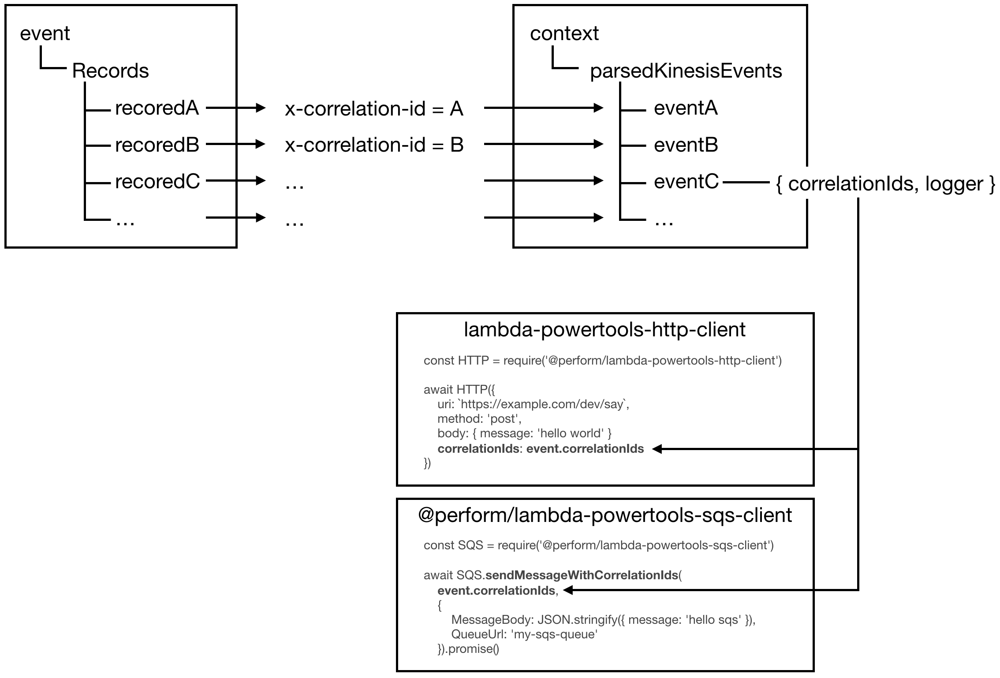

# lambda-powertools-middleware-correlation-ids

A [Middy](https://github.com/middyjs/middy) middleware that extracts correlation IDs from the invocation event and stores them with the `@dazn/lambda-powertools-correlation-ids` package.

Main features:

* stores correlation IDs with the `@dazn/lambda-powertools-correlation-ids` package

* supports API Gateway events (HTTP headers)

* supports SNS events (message attributes)

* supports SQS events (message attributes with and without raw message delivery when published from SNS)

* supports Kinesis events (see below for more details)

* supports direct invocations and Step Function tasks (the middleware looks for a `__context__` property in the JSON event)

* initializes correlation IDs using the Lambda request ID

* captures anything with prefix `x-correlation-`

* cpatures `User-Agent` from API Gateway events

* captures or initializes the `debug-log-enabled` decision based on configuration (see below) to ensure invocation follows upstream decision to enable debug logging for a small % of invocations

## Getting Started

Install from NPM: `npm install @dazn/lambda-powertools-middleware-correlation-ids`

Alternatively, if you use the template `@dazn/lambda-powertools-pattern-basic` then this would be configured for you.

## API

Accepts a configuration object of the following shape:

```js
{
  sampleDebugLogRate: double [between 0 and 1]
}
```

```js
const middy = require('middy')
const correlationIds = require('@dazn/lambda-powertools-middleware-correlation-ids')

const handler = async (event, context) => {
  return 42
}

module.exports = middy(handler)
  .use(correlationIds({ sampleDebugLogRate: 0.01 }))
}
```

This middleware is often used alongside the `@dazn/lambda-powertools-middleware-sample-logging` middleware to implement sample logging. It's **recommended** that you use the `@dazn/lambda-powertools-pattern-basic` which configures both to enable debug logging at 1% of invocations.

## Logging and Forwarding correlation IDs

**Note**: *this does not apply to `Kinesis` and `SQS` event sources, whose invocation events contain a batch of records and require different handling. Please see section below for more details.*

Once you have wrapped your handler code, the correlation IDs would be automatically included when:

* you log with the `@dazn/lambda-powertools-logger` logger
* when you make HTTP requests with the `@dazn/lambda-powertools-http-client` HTTP client
* when you interact with AWS with the various AWS SDK clients from this project

If you're using these accompanying packages then correlation IDs would simply pass through your function. However, if you wish to augment existing correlation IDs then you can also add new correlation IDs to the mix with the `@dazn/lambda-powertools-correlation-ids` package.

## Logging and Forwarding correlation IDs for Kinesis and SQS events

Because Kinesis and SQS both supports batching, it means that the invocation event can contain multiple records. Each of these records would have its own set of correlation IDs.

To address this, this middleware would extract the correlation IDs for each record and make it available for you, as well as creating a dedicated logger instance for each record. How this happens depends on the event source.

The HTTP client as well as AWS SDK clients from this project all have an override that lets you pass in these record-specific correlation IDs.

### Kinesis

For kinesis events, the middleware would do the following for each record:

1. Unzip; base64 decode; parse as JSON; and extract correlation IDs from the record body (in the `__context__` property).

2. Create an instance of `CorrelationIds` (from the `@dazn/lambda-powertools-correlation-ids` package) to hold all the extracted correlation IDs.

3. Create an instance of `Log` (from the `@dazn/lambda-powertools-logger` package) with the extracted correlation IDs already baked in.

4. Attach the correlation IDs and logger to the parsed JSON object.

5. Include the parsed JSON objects from step 4. in `context.parsedKinesisEvents`.

When using the HTTP client and AWS SDK clients from the powertools packages, you will need to include them as options or using one of the overload methods. For example:



Here's an example function.

```javascript
const Log = require('@dazn/lambda-powertools-logger')
const SNS = require('@dazn/lambda-powertools-sns-client')
const wrap = require('@dazn/lambda-powertools-pattern-basic')

module.exports.handler = wrap(async (event, context) => {
  const events = context.parsedKinesisEvents

  // you can still use the global Log instance, it'll still have the request ID for
  // the current invocation, but it won't have any of the correlation IDs for the
  // individual records
  Log.debug('received Kinesis events', { count: events.length })

  await Promise.all(events.map(evt => {
    // each parsed kinesis event has a `logger` attached to it, with the correlation IDs
    // specific for that record
    evt.logger.debug('publishing kinesis event as SNS message...')

    const req = {
      Message: JSON.stringify(evt),
      TopicArn: process.env.TOPIC_ARN
    }

    // the SNS client has an overload method for publish, which lets you pass the
    // correlation IDs specific to this parsed kinesis event
    return SNS.publishWithCorrelationIds(evt.correlationIds, req).promise()
  }))
})
```

### SQS

For SQS events, the middleware would do the following for each record:

1. Eextract correlation IDs from the message attribtues.

2. Create an instance of `CorrelationIds` (from the `@dazn/lambda-powertools-correlation-ids` package) to hold all the extracted correlation IDs.

3. Create an instance of `Log` (from the `@dazn/lambda-powertools-logger` package) with the extracted correlation IDs already baked in.

4. Attach the correlation IDs and logger to the original SQS record object.

When using the HTTP client and AWS SDK clients from the powertools packages, you will need to include them as options or using one of the overload methods. This is similar to the Kinesis example above. Here's an example function:

```javascript
const Log = require('@dazn/lambda-powertools-logger')
const SNS = require('@dazn/lambda-powertools-sns-client')
const wrap = require('@dazn/lambda-powertools-pattern-basic')

module.exports.handler = wrap(async (event, context) => {
  // you can still use the global Log instance, it'll still have the request ID for
  // the current invocation, but it won't have any of the correlation IDs for the
  // individual records
  Log.debug('received SQS events', { count: event.Records.length })

  await Promise.all(event.Records.map(record => {
    // each SQS record has a `logger` attached to it, with the correlation IDs
    // specific for that record
    record.logger.debug('publishing SQS record as SNS message...')

    const req = {
      Message: JSON.stringify(record),
      TopicArn: process.env.TOPIC_ARN
    }

    // the SNS client has an overload method for publish, which lets you pass the
    // correlation IDs specific to this SQS record
    return SNS.publishWithCorrelationIds(record.correlationIds, req).promise()
  }))
})
```
